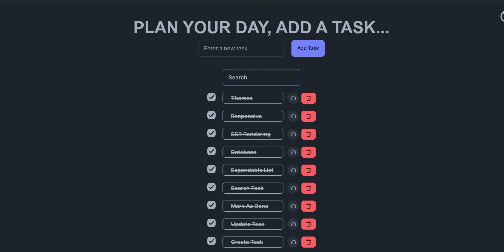

# Task Planner: Organize Your Day


## Table of Contents
- [About the Project](#about-the-project)
- [Live Demo](#live-demo)
- [Tech Stack](#tech-stack)
- [Features](#features)
- [Optimizations](#optimizations)
- [Getting Started](#getting-started)
  - [Prerequisites](#prerequisites)
  - [Installation](#installation)
- [Usage](#usage)
- [Workflow](#workflow)
- [Contributing](#contributing)
- [License](#license)
- [Contact](#contact)

## About the Project

Task Planner is a modern, efficient web application designed to help users organize their daily tasks. With a clean, intuitive interface, it allows for easy task creation, management, and tracking. Whether you're a busy professional, a student, or anyone looking to boost productivity, Task Planner is your go-to solution for staying organized.


## Live Demo(deployment)

Experience the Task Planner in action: [Task Planner Demo](https://todo-app-vidhya-sagars-projects.vercel.app/)

## Tech Stack

- **Frontend**: Next.js 13, React
- **Styling**: Tailwind CSS
- **Backend**: Next.js API Routes
- **Database**: MongoDB
- **Deployment**: Vercel

## Features

- Create, read, update, and delete tasks
- Mark tasks as complete/incomplete
- Filter tasks by task name
- Responsive design for mobile and desktop
- Dark/Light mode toggle
- Real-time updates
- Server-side rendering for improved performance



  

## Optimizations

Task Planner is built with performance and SEO in mind:

1. **Server-Side Rendering (SSR)**: Utilizes Next.js SSR for faster initial page loads and improved SEO.
2. **Metadata Optimization**: Implements Next.js built-in metadata API for better search engine visibility.
3. **Semantic HTML**: Uses semantic elements for improved accessibility and SEO.
4. **Caching**: Implements Next.js caching mechanisms to reduce server load and improve performance.
5. **Image Optimization**: Uses Next.js Image component for automatic image optimization.
6. **Code Splitting**: Leverages Next.js automatic code splitting for faster page loads.
7. **Responsive Design**: Ensures optimal viewing experience across a wide range of devices.

## Getting Started

- To get a local copy up and running, follow these simple steps.

### Prerequisites

- Node.js (v14 or later)
- npm
  
- npm install npm@latest -g

### Installation

**Clone the repo**
```
- git clone https://github.com/your_username/task-planner.git
```
**Navigate to the project directory**
```
- cd task-planner
```

**Install NPM packages**
```
- npm install
```

**Set up your environment variables in a .env.local file**
```
- MONGODB_URI=your_mongodb_connection_string
```

**Run the development server**
```
- npm run dev
```
### Usage


- Adding a Task: Click on the "Add Task" button and enter your task details.
- Completing a Task: Click the checkbox next to a task to mark it as complete.
- Editing a Task: Click on a task to open the edit modal, make your changes, and save.
- Deleting a Task: Click the delete icon next to a task to remove it.
- Toggling Theme: Use the sun/moon icon in the top right to switch between light and dark modes.

### Workflow

**Task Creation:**

- User enters task details in the input field
- Frontend sends a POST request to the API
- Backend validates the data and saves it to MongoDB
- UI updates to show the new task


**Task Management:**

- Tasks are fetched from the backend on initial page load (SSR)
- Users can mark tasks as complete, edit, or delete them
- Each action triggers an API call (PUT or DELETE)
- UI updates in real-time to reflect changes


**Data Persistence:**

- All tasks are stored in MongoDB, ensuring data is saved across sessions


**Responsive Design:**

- The application uses Tailwind CSS for a responsive layout
- UI adjusts seamlessly between desktop and mobile views


**Server-Side Rendering:**

- Initial page load fetches tasks server-side for improved performance and SEO
- Subsequent actions use client-side rendering for a smooth user experience


### Contributing
- Contributions are what make the open source community such an amazing place to learn, inspire, and create. Any 
- contributions you make are greatly appreciated.

**Fork the Project**
- Create your Feature Branch (git checkout -b feature/AmazingFeature)
- Commit your Changes (git commit -m 'Add some AmazingFeature')
- Push to the Branch (git push origin feature/AmazingFeature)
- Open a Pull Request

### License
- Distributed under the MIT License. See LICENSE for more information.